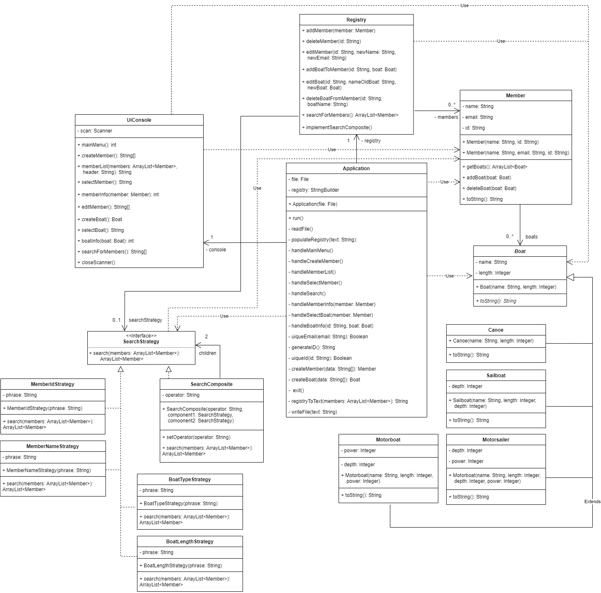

# Assigment 4
This is the generated project for assignment 4.

1. Copy the clone link and use `git clone` to make a local copy in a suitable folder on your computer.
2. Step into the created folder using `cd`
3. Build the application using `./gradlew build` - it should build without problems
4. Run the application using `./gradlew run -q --console=plain` - it should display an hello world message.
5. Open the project in your IDE (e.g. VSCode) and start programming.

## Project structure
The project contains a basic Java project file structure as generated by gradle using JUnit testing. In addition two plugins have been added to the build procedure.

1. Checkstyle using the google java standard. There are two changes to the standard: it allows for slighly longer lines, and package names may contain numbers i.e. `assignment4`

2. Findbugs. This is a static code analysis tool it analyses the code and tries to find common problems related to bugs, performance problems etc. You should strive to minimize such problems.

To make things a bit easier and more transparent to use the above quality checks are automatically run as part of the testing procedure of the implementation. If you have errors these will be reported as JUnit test case problems, if you have too many such issues the build will fail.

Use `./gradlew build` to build the system - this will also report errors from the plugins above in the console. If you have many issues it is adviced to tackle the first one.

To run the application use `./gradlew run -q --console=plain`

## Build Pipeline
When pusing code to gitlab a build pipeline will run. This will try to build the code and then run all the tests. This is one of the main advantages of using gradle: we get a uniform and distributable way to build and test our system that can be automatically run. In our case we run gradle in a docker image build using gradle 7.3.3, jdk17 and alpine linux. 

The results of the build process will be shown to you, and you can dig deeper by using the CI/CD menu in gilab. If there are any failures it is adviced to check the outputs of the respective steps and try to figure out what could be the problem. You can also inspect the test report of the automatic testing step.

## Adding existing code
If you have already worked on the task in whole or part using your own gradle setup we reccomend that you copy only the source code files into this structure. Your source code should be copied into the `app/src/main/java/` folder and you can change the `application` `mainClass` in `build.gradle` accordingly.

## Student's notes
### Code quality
There is a lot of code in Application and UIConsole, and it might have been possible to divide that code further into more classes. It's hard to get an overview of the code since the files are so long. I also had a hard time naming the methods in these two classes. Because these two classes communicate a lot with eachother, many methods have similar names. For example, UIConsole has a method called createMember, which the method handleCreateMember in Application is calling, then processing its return value. The return value is an array of data about the member that should be created. This is done by the method createMember in Application (i.e. the same method name as in UIConsole). I'm not sure if this similarity of method names makes it clearer that they belong together, or if it makes the code more confusing.

### Composite pattern
A method to try out the implementation of the composite pattern is provided in Registry, called implementSearchComposite.

### JUnit tests
I've looked over the methods in my code but I have a hard time finding methods that would be suitable to test. Most methods are void, or dependent on other objects that I don't create within the method which gets too complicated to recreate for each test case. For example if I would like to test the method uniqueEmail in Application, the method uses a Register object, which attribute "members" has been populated with Member objects. Many methods are also dependent on iput from the user which will not be possible to simulate in a test case. I would have liked too implement more tests, but I have trouble finding any suitable methods other than simple getters and setters.

## Class diagram
